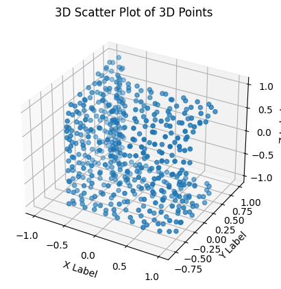
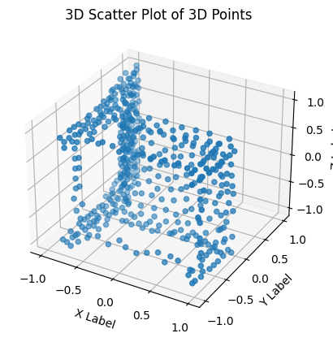

# Model-Generation-via-Base-Topology
We propose a novel method for 3D object generation using a CNN with a tailored loss function. Employing a single input-ground truth pair, we perform iterative forward passes through the CNN, updating weights based on the calculated loss after each pass. This loss function combines a topological loss, ensuring the generated object shares the desired structure from the ground truth, with a geometric discrepancy term, preserving similarity to the input object. This approach empowers users to steer the generation process towards a specific topology while incorporating the geometry of a starting point. We investigate the efficacy of this method and its potential for facilitating creative 3D object generation.



# Google Colab Notebook
You can run this project in Google Colab. Follow the link below to access the notebook:
[Open in Google Colab](https://colab.research.google.com/drive/1_5qBaX5I-S2PAUe3SM5r1GB7TRnD1twj?usp=sharing)

  Required Files
  To run the project in Google Colab, you may need to upload the following files:
  - input_norm.npy
  - output_norm.npy

# Project Setup and Installation Guide
This README provides step-by-step instructions to install the necessary Python libraries for your project. The following libraries will be installed:

```bash
# Install PyTorch
pip install torch

# Install NumPy
pip install numpy

# Install GUDHI
pip install gudhi

# Install Matplotlib
pip install matplotlib

# Install IPython
pip install ipython

# Install POT (Optimal Transport library)
pip install pot

# For visualization
pip install scipy
pip install open3d
```


